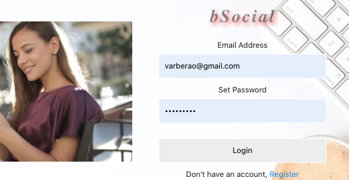
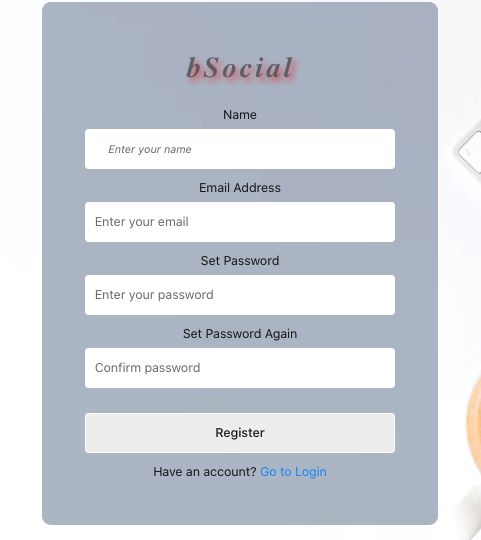
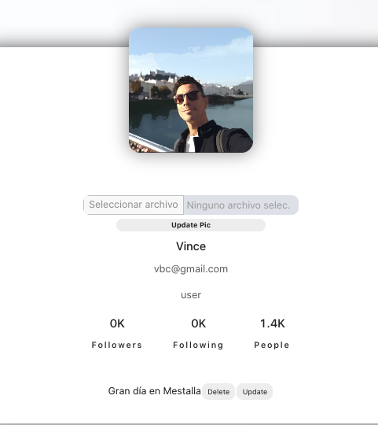
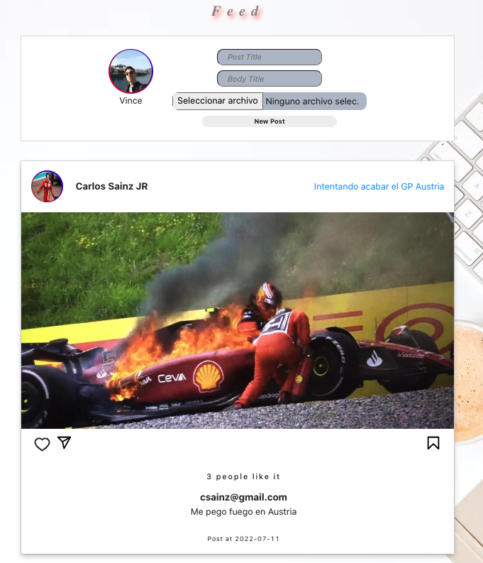
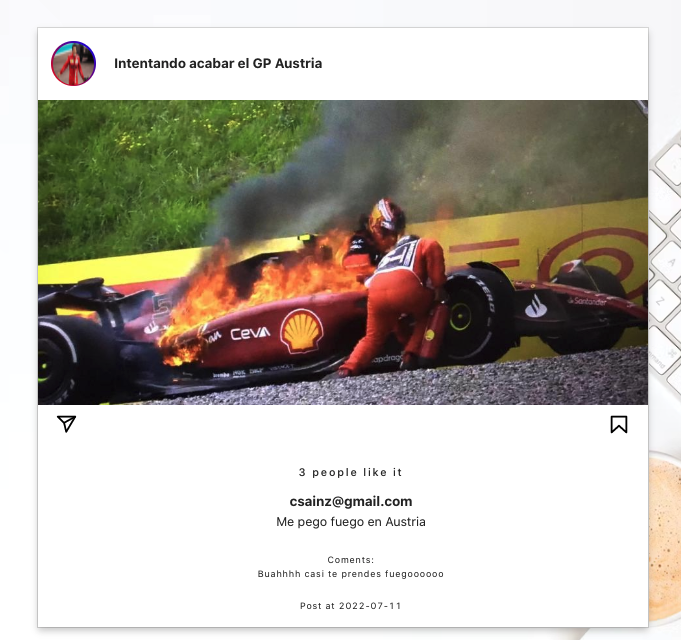

# MERN SOCIAL MEDIA APP

The main objective of this project is to build a social network with the MERN stack. The name of the social network is bSocial!

In order to be functional, I have tried to make the project beautiful and minimalist. And that this sensation can be transmitted to the public....So... Welcome to bSocial!

## Built with....

MERN stands for MongoDB, Express, React, Node, after the four key technologies that make up the stack:

- MongoDB - document database
- Express(.js) - Node.js web framework
- React(.js) - a client-side JavaScript framework
- Node(.js) - the premier JavaScript web server

## Getting Started - Installation

1. To deploy this project you must clone the Backend repository through the following link:

```
https://github.com/Vincecoorp21/Social-Network-Mongoose
```

2. Install all dependecies

```
npm i
```

3. Fill in authentication variables in the .env.example file.

4. Launch the Backend Project

```
npm run dev
```

5. Clone Frontend repository.

```
https://github.com/Vincecoorp21/MERN-STACK---Social-Network
```

6. Run `npm install` command

7. Run `npm start` command

## Project Achievements

| Achievements                                      |
| ------------------------------------------------- |
| User Login                                        |
| User Register                                     |
| User can change profile picture                   |
| User can make posts                               |
| User can edit posts                               |
| User can delete posts                             |
| User can delete posts                             |
| User can like/dislike posts                       |
| User Profile: user can see their posts & comments |

## Social Media Preview

### 1. Landing


### 2. Login



### 3. Register



### 4. Profile



### 5. Feed



### 6. Post Detail



## Author

👤 **Vince BC**

- Twitter: [@VinceTrend](https://twitter.com/VinceTrend)
- Github: [@Vincecoorp21](https://github.com/Vincecoorp21)
- Linkedin:[@vibarcar](https://www.linkedin.com/in/vibarcar/)

This project was developed By [Vicente Barberá - Vince BC -](https://github.com/Vincecoorp21)
